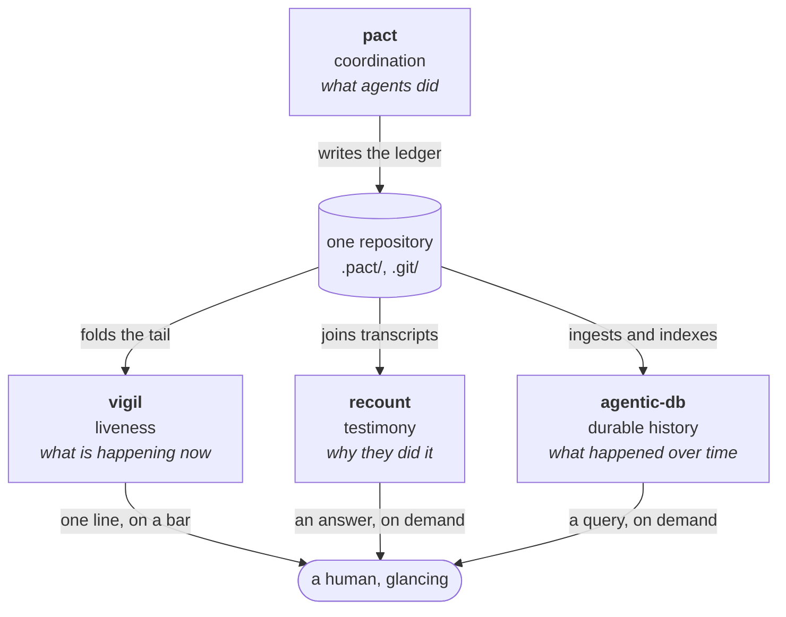

# vigil

**Is the fleet alive, right now?** vigil answers that one question, in one line,
cheaply enough to put on a status bar and leave there.

The repository is `quivive` — *être sur le qui-vive*, to be on the alert. The tool
it holds is `vigil`.

> **State of the work:** the crate is built and does what this page describes —
> `mise run check` is green, and the design's load-bearing invariant is asserted
> against real pact ledgers and against concurrent writers. Unreleased: there is no
> tag, no published binary, and no cross-platform promise
> ([D9](docs/adr/0003-yagni-deferral-register.md)). Build it with `mise run build`.

## The problem

Run eight coding agents on one repository and you acquire a supervision problem
that none of the tools in front of you solve.
[pact](https://github.com/chussenot/pact) records what the agents did.
[recount](https://github.com/chussenot/recount) can tell you why they did it.
[agentic-db](https://github.com/chussenot/agentic-db) will remember all of it. All
three answer questions about **the past**, and they answer them when you ask.

The question you actually have, continuously, is about **the present**: how many
agents are working, is anyone stuck, and did anyone die holding a lease that is now
blocking somebody else. Today you answer it by reading an append-only JSON log by
eye, which is not a glance — and the whole value of the answer is that it should
cost a glance.

## The gap vigil fills

pact is the only writer. The other three read the same files and differ in *what
question they are for* — and therefore in what they are allowed to cost. recount
and agentic-db are asked occasionally and may take a second; vigil is asked every
second and must not.

**The boundary with agentic-db is the important one**, because it is the one that
would otherwise erode. agentic-db owns *history and queries over it*: durable
storage, indexing, retention, "how long was agent-3 stale yesterday". vigil owns
*the present moment*, computes it from the files on disk, and stores nothing but a
cursor it must be able to throw away. The first time vigil needs to remember
something to answer a question, the question belongs to agentic-db and vigil should
say so rather than grow a database. That is written down, with the condition that
would reverse it, as [D1 in the deferral register](docs/adr/0003-yagni-deferral-register.md).

## Why it is shaped this way

**It folds a stream; it does not query an index.** A tile is a reduction over an
append-only log, asked about the last sixty seconds of it, once a second, forever.
So vigil reads only the bytes appended since the last tick and keeps one cursor —
and that cursor must be *correct to throw away*: delete it, re-read everything, get
a byte-identical tile. An index would be faster to query and would also be a second
source of truth that can disagree with the ledger, which is a class of bug vigil
declines to own. → [ADR-0001](docs/adr/0001-stream-first-tile.md)

**There is no daemon, and vigil does not draw.** A status bar is already a
scheduler, so vigil is a one-shot process: start, read, print one tile, exit.
Nothing to install, nothing to supervise, nothing whose crash produces a stale tile
that looks fresh. And what it prints is a *contract*, not a picture — colour,
glyphs and bar-specific encodings belong to the renderer, because a tool that draws
beautifully for one bar draws badly for five. → [ADR-0002](docs/adr/0002-no-daemon-renderer-boundary.md)

**A tick is a pure function of (ledger, clock, thresholds).** That is not
architectural taste; it is what makes the emitted shape pinnable by golden tests
instead of by prose, and it is why a golden here never needs a `sleep`. →
[the tile contract](docs/tile-contract.md)

**`DEAD` is a claim vigil is willing to be wrong about, loudly.** It is the one
state anybody acts on, so the thresholds behind it are the user's business: a fleet
whose beads take an hour needs different windows than one whose beads take a
minute, and no default is right for both. → [the state machine](docs/adr/0001-stream-first-tile.md)

## What vigil refuses

Ten refusals, each with **the condition that would reverse it**, live in the
[YAGNI deferral register](docs/adr/0003-yagni-deferral-register.md). The register
is a decision record rather than a paragraph here for a reason: several of those
rows are expected to be reversed, and a README is read once and never re-read.

In summary: no history or queries, no daemon or socket, no notifications, no TUI,
no network, no config file, no plugin SPI, no persistence beyond the cursor, no
platform promises, and no guessing at liveness from anything agents did not
themselves write down. Each of those names either who owns it instead, or the
evidence that would change the answer.

## Provenance

vigil's conventions came before its code, on purpose. The [house
conventions](docs/conventions.md) — mise as the only task runner, cocogitto owning
the version and changelog, front matter on every page, priced alternatives in every
ADR — were established and *proven against a seeded-breakage run* before a line of
Rust existed. The [spec](docs/spec.md) and the [tile
contract](docs/tile-contract.md) were written next, and the contract was then
implemented unchanged, which was the point of writing it first: the goldens had
something to be golden against.

The [field notes](docs/studies/conventions-run.md) from both runs are worth more
than that summary suggests, because the recurring finding was not about vigil. Six
times, a check passed for a reason other than the one claimed — a gate red for an
unrelated cause, a negative control that failed on a config error, a stale binary,
a soak test that a deliberately broken cursor sailed through twice. Every one was
caught by reading the message instead of the exit code, or by breaking the thing
on purpose to see the check go red.

The pattern is inherited: pact and recount are built the same way, and this
repository ports two of their roles outright.

## Documentation

| Page | Read it for |
|---|---|
| [docs/conventions.md](docs/conventions.md) | the house rules, and which gate enforces each |
| [docs/spec.md](docs/spec.md) | the readers, the state machine, the tick, the ceilings |
| [docs/tile-contract.md](docs/tile-contract.md) | the emitted shape, the text form, exit codes, versioning |
| [docs/adr/](docs/adr/README.md) | the decisions, with alternatives priced |
| [docs/studies/](docs/studies/conventions-run.md) | field evidence from real runs |
| [.claude/agents/](.claude/agents/docs-writer.md) | the recurring roles this repository is worked by |

Contributors: `mise run check` is the whole required gate, and it is the same
commands CI runs.
