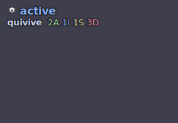
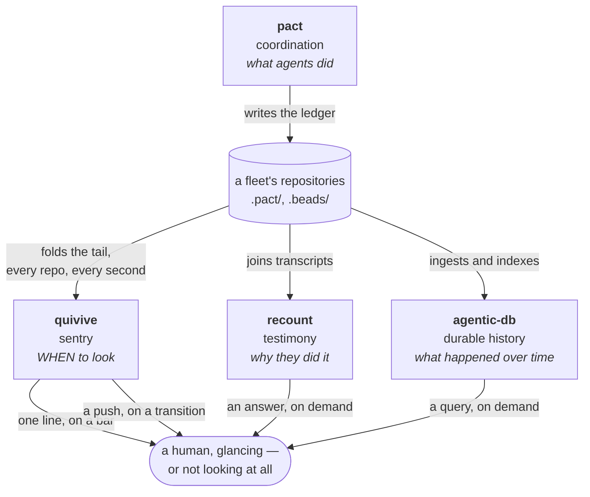

# quivive

*Qui-vive* — the sentry's challenge, *être sur le qui-vive*, to be on the alert.
**Is the fleet alive, right now, and does a human need to look?** quivive
answers that, cheaply enough to run on a status bar every second and to push a
notification the moment the answer changes.

*The tile above is not a mockup: it is `quivive tile` run against this
repository's own committed `.pact/events.jsonl`, rendered by the
[pwetty tile](https://github.com/chussenot/waybar-pwetty-box) this run
contributed — the fleet that built quivive, seen through quivive, mid-build.
pact records, recount explains, quivive stays on the qui-vive.*

> **State of the work:** 0.1.0 is tagged — the crate does what this page
> describes, `mise run check` is green, and the design's load-bearing invariant
> is asserted against real pact ledgers and against concurrent writers. Still no
> published binary and no cross-platform promise
> ([D9](docs/adr/0003-yagni-deferral-register.md)); `mise run install` from a
> checkout is the supported path, and the
> [changelog](CHANGELOG.md)'s Notes say why the release exists.

## The problem

Run eight coding agents across a fleet of repositories and you acquire a
supervision problem that none of the tools in front of you solve.
[pact](https://github.com/chussenot/pact) records what the agents did.
[recount](https://github.com/chussenot/recount) can tell you why they did it.
[agentic-db](https://github.com/chussenot/agentic-db) watches the session and
remembers it. All three answer questions about **the past**, and they answer
them when you ask.

The question you actually have, continuously, is about **the present**: how many
agents are working, is anyone stuck, and did anyone die holding a lease that is now
blocking somebody else. Today you answer it by reading an append-only JSON log by
eye, which is not a glance — and the whole value of the answer is that it should
cost a glance, or no glance at all when nothing needs one.

## The gap quivive fills

pact is the only writer. The other three read the same files and differ in *what
question they are for* — and therefore in what they are allowed to cost. recount
and agentic-db are asked occasionally and may take a second; quivive is asked
every second across a whole fleet of repositories and must not — and it is the
only one of the four built to say something *unasked*, through `quivive watch`'s
notifications, precisely because "look now" is a question nobody thinks to ask
until it is too late to matter.

**The boundary with agentic-db is the important one**, because it is the one that
would otherwise erode. agentic-db owns *history and queries over it*: durable
storage, indexing, retention, "how long was agent-3 stale yesterday" — and it
answers that for the family across machines, because only the **task graph**
travels over Dolt's own sync. Liveness, leases and the repo registry stay
single-machine, on purpose: pact itself reads only bd's *committed* sidecar
file, never agentic-db's live index of it, and quivive's own sidecar reader
(S4) follows that same rule — so quivive works identically whether or not
agentic-db is even installed, and never becomes a second consumer of a service
that is not this family's to depend on. quivive owns *the present moment*,
computes it from the files on disk, and stores nothing but a cursor it must be
able to throw away. The first time quivive needs to remember something to
answer a question, the question belongs to agentic-db and quivive should say
so rather than grow a database. That is written down, with the condition that
would reverse it, as
[D1 in the deferral register](docs/adr/0003-yagni-deferral-register.md).

## Why it is shaped this way

**It folds a stream; it does not query an index.** A tile is a reduction over an
append-only log, asked about the last sixty seconds of it, once a second, forever,
across every repository the registry names. So quivive reads only the bytes
appended since the last tick and keeps one cursor per repo — and that cursor must
be *correct to throw away*: delete it, re-read everything, get a byte-identical
tile. An index would be faster to query and would also be a second source of
truth that can disagree with the ledger, which is a class of bug quivive declines
to own. → [ADR-0001](docs/adr/0001-stream-first-tile.md)

**There is no daemon, and quivive does not draw.** A status bar is already a
scheduler, so `quivive tile` is a one-shot process: start, read, print one tile,
exit. `quivive tile --stream` and `quivive watch` are both foreground loops a
human starts and owns, not services — nothing to install, nothing to supervise,
nothing whose crash produces a stale tile that looks fresh. And what quivive
prints is a *contract*, not a picture — colour, glyphs and bar-specific encodings
belong to the renderer, because a tool that draws beautifully for one bar draws
badly for five. `watch`'s own notifications hold the same line from the other
side: they *say*, through the desktop's own notifier, and never *act* — quivive
names the family's follow-up command and stops there.
→ [ADR-0002](docs/adr/0002-no-daemon-renderer-boundary.md)

**A tick is a pure function of (ledger, clock, thresholds).** That is not
architectural taste; it is what makes the emitted shape pinnable by golden tests
instead of by prose, and it is why a golden here never needs a `sleep`. →
[the tile contract](docs/tile-contract.md)

**`DEAD` is a claim quivive is willing to be wrong about, loudly.** It is the one
state anybody acts on, so the thresholds behind it are the user's business: a fleet
whose beads take an hour needs different windows than one whose beads take a
minute, and no default is right for both. → [the state machine](docs/spec.md#the-state-machine)

## What quivive refuses

Fifteen refusals, each with **the condition that would reverse it**, live in the
[YAGNI deferral register](docs/adr/0003-yagni-deferral-register.md). The register
is a decision record rather than a paragraph here for a reason: several of those
rows are expected to be reversed, and a README is read once and never re-read.

In summary: no history or queries, no daemon or socket, no hooks or acting on a
transition beyond a one-way desktop notification, no TUI, no network or
multi-machine anything, no config file, no plugin SPI, no persistence beyond the
cursor, no platform promises, no guessing at liveness from anything agents did
not themselves write down — and, named in v0.1's own charter rather than
discovered afterward, no rendering beyond pwetty's house style, no install or
config generators, no quiet hours, no polling a shared branch's CI status from
the tick path, and no registry subcommands. Each of those names either who owns
it instead, or the evidence that would change the answer.

## Provenance

quivive's conventions came before its code, on purpose. The [house
conventions](docs/conventions.md) — mise as the only task runner, cocogitto owning
the version and changelog, front matter on every page, priced alternatives in every
ADR — were established and *proven against a seeded-breakage run* before a line of
Rust existed. The [spec](docs/spec.md) and the [tile
contract](docs/tile-contract.md) were written next, and the contract's first shape
was then implemented unchanged, which was the point of writing it first: the
goldens had something to be golden against. It was reshaped exactly once since —
a deliberate, breaking move from one repository to a fleet of them, tracked as
such in [the tile contract](docs/tile-contract.md#this-is-a-breaking-reshape-and-v-does-not-move)
rather than pretended into an unbroken line.

The [field notes](docs/studies/conventions-run.md) from these runs are worth more
than that summary suggests, because the recurring finding was not about quivive.
Six times, a check passed for a reason other than the one claimed — a gate red for
an unrelated cause, a negative control that failed on a config error, a stale
binary, a soak test that a deliberately broken cursor sailed through twice. Every
one was caught by reading the message instead of the exit code, or by breaking the
thing on purpose to see the check go red.

The pattern is inherited: pact and recount are built the same way, and this
repository ports two of their roles outright.

## Documentation

| Page | Read it for |
|---|---|
| [docs/conventions.md](docs/conventions.md) | the house rules, and which gate enforces each |
| [docs/spec.md](docs/spec.md) | the readers, the state machine, the tick, the ceilings |
| [docs/tile-contract.md](docs/tile-contract.md) | the emitted shape, the text form, exit codes, versioning |
| [docs/adr/](docs/adr/README.md) | the decisions, with alternatives priced |
| [docs/studies/](docs/studies/conventions-run.md) | field evidence from real runs |
| [docs/beads-on-other-laptops.md](docs/beads-on-other-laptops.md) | reaching the task graph from a second machine, and the boundary of what travels |
| [.claude/agents/](.claude/agents/docs-writer.md) | the recurring roles this repository is worked by |

Contributors: `mise run check` is the whole required gate, and it is the same
commands CI runs.
