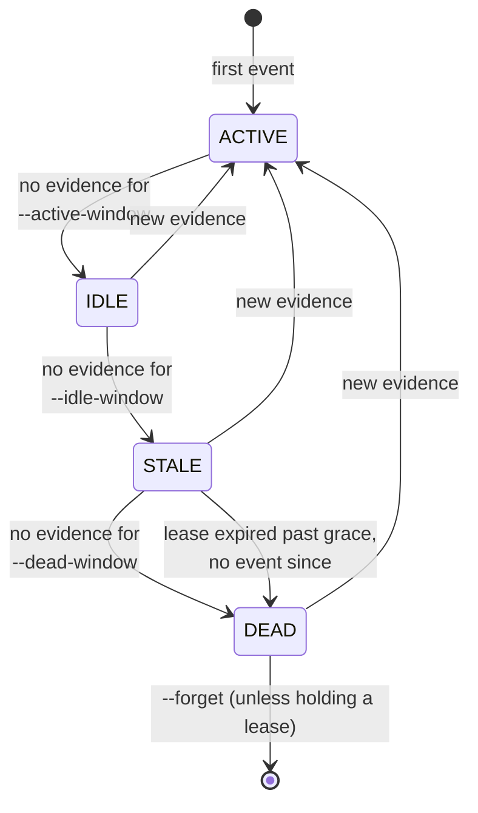
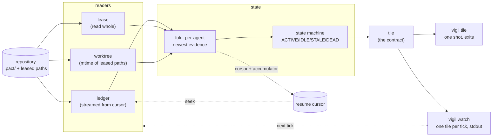

# vigil specification

This page was written before the crate and is now implemented by it. Two things
changed in the writing of the code, and both are recorded rather than quietly
corrected: the third reader is a **worktree** reader rather than a git one (see
below), and the ceilings are now measured numbers rather than intentions
([docs/studies/conventions-run.md](studies/conventions-run.md)).

One job: **say whether a fleet of coding agents is alive, right now, in one
line.** Everything below is in service of that sentence, and anything that is not
is in the [deferral register](adr/0003-yagni-deferral-register.md).

## Readers

A reader turns one surface of a repository into events or facts the fold can use.
There are three, they are compiled in ([D7](adr/0003-yagni-deferral-register.md)),
and each is allowed to fail independently — a repository with no leases is a
normal repository, not a broken one.

| Reader | Reads | Shape | Missing means |
|---|---|---|---|
| **ledger** | `.pact/events.jsonl` | append-only, streamed from a cursor | no pact in this repo — vigil has nothing to say and says so (`degraded: ["ledger"]`) |
| **lease** | `.pact/leases/*.lock` | small, mutable, read whole each tick | no agent currently holds a path. **Not** degraded: nobody holding a path is a repository's resting state |
| **worktree** | the mtime of each leased path | one `stat` per lease | nothing. A leased path that does not exist yet is the normal way to claim a file you are about to write |

The ledger is the only streamed input, and the only one with a cursor. That
asymmetry is deliberate and is explained in
[ADR-0001](adr/0001-stream-first-tile.md#consequences): the other two are small
and mutable, so a cursor over them would be a cache with nothing to gain.

The state directory is `<repo>/.pact`, or `PACT_STATE_DIR` when that is set —
because pact honours it, and a repository whose state has been redirected is one
where `<repo>/.pact` is empty. pact's *worktree-scope* redirection is deliberately
not reimplemented: that would be a second copy of somebody else's resolution
logic, and it would drift.

### The worktree reader, and why it is not called the git reader

An agent can be very much alive and write nothing to the ledger for minutes at a
stretch, because it is thinking or compiling. Without a third reader, a compile
longer than `--active-window` reports IDLE and one longer than `--idle-window`
reports STALE — the tile crying wolf about the most normal thing an agent does.

The first draft of this page called that reader **git**, because the surface it
reads sounded like git's. Implementing it showed the liveness evidence is the
filesystem's mtime and nothing else: no ref, no index, no `HEAD`. The page was
renamed to match the code rather than the code bent to match the page.

It is a near neighbour of the refusal in
[D10](adr/0003-yagni-deferral-register.md) — no guessing at liveness from ambient
machine state — and stays on the right side of it for two reasons worth stating
rather than assuming. The mtime is a trace **the agent wrote**, not an inference
about a process; and it is only ever read for a path the agent **explicitly
claimed** with a lease, so vigil cannot credit one agent with another's work, or
with a `git checkout`. A lease path that is absolute or contains `..` is ignored
outright: a lock file is data on disk, and joining it onto the repository root
would let it point vigil anywhere.

### Which event kinds count as evidence

Almost all of them, and three do not. This is not guessable from the field names;
it comes from pact's own schema:

* `expired` — the *sweeper* wrote the row, and its `agent` names the holder whose
  claim ended, who by definition did nothing. Counting it would resurrect exactly
  the agent that just went quiet.
* `displaced` — same shape: the row belongs to the overridden holder, not to
  whoever overrode it (who gets a `stolen` row of their own, which does count).
* `annotation` — a correction pointing at earlier lines, authored in `actor`
  rather than `agent`. A human annotating last week is not an agent working now.

Anything else counts, **including a kind this version of vigil has never heard
of**. That direction is the safe one: a new pact event kind works here the day
pact ships it, and the cost of being wrong is reporting an agent alive one tick
longer than it was.

## The state machine

Each agent seen in the ledger has exactly one state per tick. The state is
decided by the age of the newest evidence for that agent, against three
thresholds, with lease expiry as the one non-recency input.

The default windows are four string constants in `src/state.rs`, parsed by both
`Thresholds::default()` and clap — so `vigil tile --help` is where you look them
up, and there is no second copy anywhere to go stale. They are not repeated here
for that reason.

| State | Means | Reading it |
|---|---|---|
| `ACTIVE` | evidence within `--active-window` | working |
| `IDLE` | quiet, but recently loud | thinking, compiling, or between beads — normal |
| `STALE` | quiet longer than an agent usually is | worth a look |
| `DEAD` | quiet past `--dead-window`, or holding an expired lease with nothing since | gone; if it holds a lease, that lease is blocking somebody |

Three properties of this machine matter more than the thresholds:

- **Every transition is driven by elapsed time or by new evidence, and nothing
  else.** There is no state that depends on how the previous tick was computed,
  which is what makes a tick a pure function and the goldens meaningful.
- **Recovery is always direct to `ACTIVE`.** An agent that writes an event is
  alive; there is no convalescence, and no state that requires two ticks to leave.
  A machine with hysteresis would be more stable on a flapping fleet and would
  also make the tile depend on tick *history*, which
  [ADR-0001](adr/0001-stream-first-tile.md) forbids.
- **`DEAD` is a claim vigil is willing to be wrong about, loudly.** It is the one
  state anybody acts on, so it is the one place the thresholds are a user's
  business: a fleet whose beads take an hour needs a different `--dead-window`
  than one whose beads take a minute, and no default is right for both.

The `--forget` sweep at the end is bookkeeping, not a state: an agent nobody has
heard from in an hour stops occupying space in the tile so that a week-old
repository does not render forty dead names.

## The tick

The dotted edges are the only state that survives a tick, and
[ADR-0001](adr/0001-stream-first-tile.md) is the rule about them: **deleting the
cursor and re-running must produce a byte-identical tile.** The solid edges are
the whole computation.

`vigil watch` re-enters the readers on a timer and is not a daemon — see
[ADR-0002](adr/0002-no-daemon-renderer-boundary.md) for what that distinction
does and does not buy.

### Ceilings

Two numbers, both release-profile, both enforced by `mise run bench` against a
100,000-event synthetic ledger. The ceilings themselves live as constants in
`tests/bench.rs` rather than being quoted here, so this page cannot drift from
what is actually asserted.

- **Warm tick** (cursor valid, a handful of new events). This is the number the
  whole design exists to make possible, and its failure is the documented
  reversal condition for [D2](adr/0003-yagni-deferral-register.md) — a daemon. A
  genuine failure here is an ADR conversation, not a tuning exercise.
- **Cold tick** (no cursor, full re-read). Slow is acceptable; *wrong* is not.
  The cold path's job is to produce the same tile as the warm path, and
  `mise run fleet` is what holds it to that.

The measured values, and the ratio between them, are in
[docs/studies/conventions-run.md](studies/conventions-run.md). A bench run that
needs a `sleep`, or a golden that does, is a report that the tick has stopped
being a pure function.

## What vigil refuses

The refusals, each with the condition that would reverse it, are the
[YAGNI deferral register](adr/0003-yagni-deferral-register.md). They are not
repeated here: a refusal stated in two places is a refusal that will shortly be
stated differently in two places.

The one worth restating, because it is a boundary rather than a deferral: vigil
answers a question about *now*. Every question about *then* belongs to
[agentic-db](https://github.com/chussenot/agentic-db), and every question about
*why* belongs to [recount](https://github.com/chussenot/recount).
