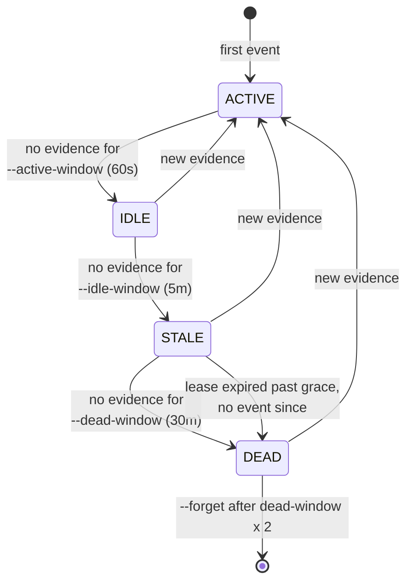
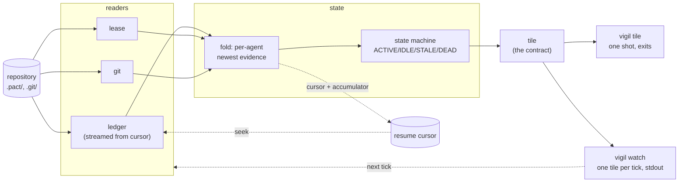

# vigil specification

`status: draft` is accurate and load-bearing: this page specifies behaviour the
crate does not implement yet. It is the target the implementation is written
against, not a description of a binary you can run. When the crate lands, the
parts of this page it satisfies become `active` and the parts it does not stay
here as the remaining work.

One job: **say whether a fleet of coding agents is alive, right now, in one
line.** Everything below is in service of that sentence, and anything that is not
is in the [deferral register](adr/0003-yagni-deferral-register.md).

## Readers

A reader turns one surface of a repository into events or facts the fold can use.
There are three, they are compiled in ([D7](adr/0003-yagni-deferral-register.md)),
and each is allowed to fail independently — a repository with no leases is a
normal repository, not a broken one.

| Reader | Reads | Shape | Missing means |
|---|---|---|---|
| **ledger** | `.pact/events.jsonl` | append-only, streamed from a cursor | no pact in this repo — vigil has nothing to say and says so |
| **lease** | `.pact/leases/` | small, mutable, read whole each tick | no agent currently holds a path |
| **git** | `HEAD`, the index, the worktree | small, mutable, read whole each tick | not a git repository |

The ledger is the only streamed input, and the only one with a cursor. That
asymmetry is deliberate and is explained in
[ADR-0001](adr/0001-stream-first-tile.md#consequences): the other two are small
and mutable, so a cursor over them would be a cache with nothing to gain.

The git reader exists for one reason that is easy to miss: an agent can be very
much alive and write nothing to the ledger for minutes at a stretch, because it is
thinking or compiling. A dirty worktree under a path that agent holds a lease on
is evidence of life that the ledger does not carry.

## The state machine

Each agent seen in the ledger has exactly one state per tick. The state is
decided by the age of the newest evidence for that agent, against three
thresholds, with lease expiry as the one non-recency input.

| State | Means | Reading it |
|---|---|---|
| `ACTIVE` | evidence within `--active-window` | working |
| `IDLE` | quiet, but recently loud | thinking, compiling, or between beads — normal |
| `STALE` | quiet longer than an agent usually is | worth a look |
| `DEAD` | quiet past `--dead-window`, or holding an expired lease with nothing since | gone; if it holds a lease, that lease is blocking somebody |

Three properties of this machine matter more than the thresholds:

- **Every transition is driven by elapsed time or by new evidence, and nothing
  else.** There is no state that depends on how the previous tick was computed,
  which is what makes a tick a pure function and the goldens meaningful.
- **Recovery is always direct to `ACTIVE`.** An agent that writes an event is
  alive; there is no convalescence, and no state that requires two ticks to leave.
  A machine with hysteresis would be more stable on a flapping fleet and would
  also make the tile depend on tick *history*, which
  [ADR-0001](adr/0001-stream-first-tile.md) forbids.
- **`DEAD` is a claim vigil is willing to be wrong about, loudly.** It is the one
  state anybody acts on, so it is the one place the thresholds are a user's
  business: a fleet whose beads take an hour needs a different `--dead-window`
  than one whose beads take a minute, and no default is right for both.

The `--forget` sweep at the end is bookkeeping, not a state: an agent nobody has
heard from in an hour stops occupying space in the tile so that a week-old
repository does not render forty dead names.

## The tick

The dotted edges are the only state that survives a tick, and
[ADR-0001](adr/0001-stream-first-tile.md) is the rule about them: **deleting the
cursor and re-running must produce a byte-identical tile.** The solid edges are
the whole computation.

`vigil watch` re-enters the readers on a timer and is not a daemon — see
[ADR-0002](adr/0002-no-daemon-renderer-boundary.md) for what that distinction
does and does not buy.

### Ceilings

Two numbers, both release-profile, both measured by `mise run bench` against a
synthetic ledger rather than asserted here:

- **Warm tick** (cursor valid, a handful of new events): fast enough to run at
  1 Hz without being noticeable, on a ledger of 100k events. This is the number
  the whole design exists to make possible, and the number whose failure is the
  reversal condition for [D2](adr/0003-yagni-deferral-register.md) — a daemon.
- **Cold tick** (no cursor, full re-read of 100k events): slow is acceptable,
  *wrong* is not. The cold path's job is to produce the same tile as the warm
  path, and `mise run fleet` is what holds it to that.

A bench run that needs a `sleep`, or a golden that does, is a report that the tick
has stopped being a pure function.

## What vigil refuses

The refusals, each with the condition that would reverse it, are the
[YAGNI deferral register](adr/0003-yagni-deferral-register.md). They are not
repeated here: a refusal stated in two places is a refusal that will shortly be
stated differently in two places.

The one worth restating, because it is a boundary rather than a deferral: vigil
answers a question about *now*. Every question about *then* belongs to
[agentic-db](https://github.com/chussenot/agentic-db), and every question about
*why* belongs to [recount](https://github.com/chussenot/recount).
