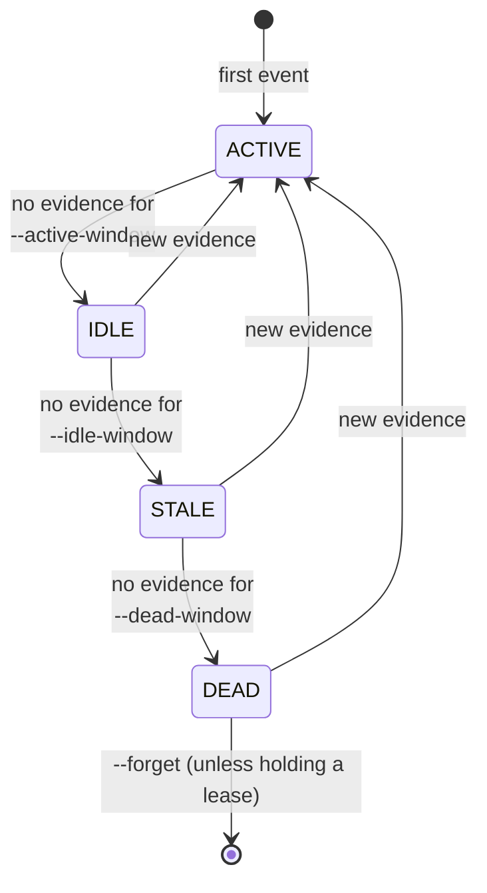
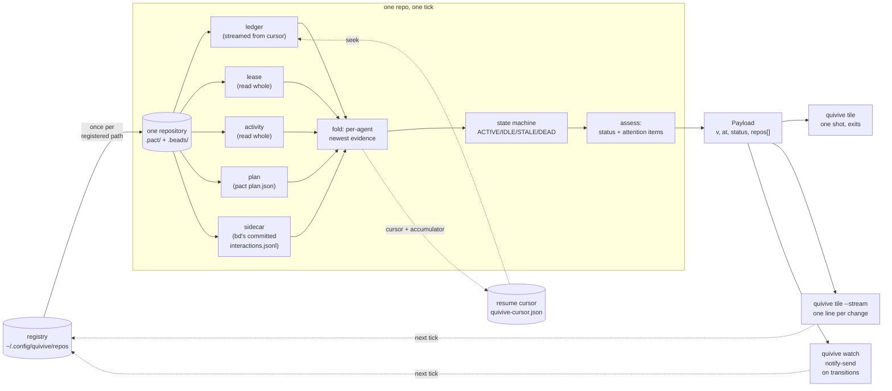

# quivive v0.1

*Qui-vive*: the sentry's challenge. quivive is the fleet-presence layer of the
family — [pact](https://github.com/chussenot/pact) records what happened,
[recount](https://github.com/chussenot/recount) explains why,
[agentic-db](https://github.com/chussenot/agentic-db) watches the session,
**quivive tells the human WHEN TO LOOK**. Read-only, compositor-agnostic, no
daemon-as-coordinator, no hooks, no SQLite, nothing agentic-db already does.
Each numbered line below is quotable; a bead's acceptance criteria quote the
lines they satisfy.

## Registry

- S1. The registry is plain text at `~/.config/quivive/repos` (honouring
  `XDG_CONFIG_HOME`), one repository path per line, hand-edited; blank lines and
  `#` comments are ignored, `~` expands.
- S2. There are no registry subcommands; a missing registry file means an empty
  registry, not an error.

## Tick

- S3. A tick is file reads only — no subprocess, no network, no database.
- S4. Per repo the tick reads: `.pact/leases/*` and `.pact/activity/*`, the tail
  of `.pact/events.jsonl` (tolerant of garbage lines), `.pact/plan.json`, and
  bd's committed sidecar `.beads/interactions.jsonl` when present.
- S5. The tick is mtime-pruned: a repo none of whose source files changed since
  the last tick is skipped without being re-read.
- S6. Steady-state tick cost is under 10 ms per repo, release profile, enforced
  by `mise run bench`.
- S7. Per-agent state is the four-state machine ACTIVE/IDLE/STALE/DEAD of
  [ADR-0001](adr/0001-stream-first-tile.md), fed by newest evidence across
  leases, activity records and the events tail.
- S8. Per-repo status is derived, in precedence order: `human-needed` (any
  attention item, S16–S19), else `active` (any ACTIVE/IDLE agent), else
  `drained` (a plan or recent fleet evidence exists but no live agent remains),
  else `all-quiet` (pact present, nothing moving), else `no-fleet` (no pact
  state at all).

### The readers

Five, each allowed to fail independently — a repository with no leases is a
normal repository, not a broken one:

| Reader | Reads | Cursor | Missing means |
|---|---|---|---|
| **ledger** | tail of `.pact/events.jsonl` | yes — the only streamed input (S4) | no pact in this repo |
| **lease** | `.pact/leases/*` | no — small, read whole each tick | nobody currently holds a path; a repository's resting state |
| **activity** | `.pact/activity/*` | no — small, read whole each tick | no activity directory: an older pact, or a fleet that has not run a command yet this checkout |
| **plan** | `.pact/plan.json` | no — one clean snapshot or none | no plan.json: an undirected fleet, not a broken one |
| **sidecar** | `.beads/interactions.jsonl` | no — append-only but small; read whole is cheaper than a cursor here | bd's audit export is off, or there is no bd at all |

**`activity` replaced a `worktree` reader** this page and [ADR-0001](adr/0001-stream-first-tile.md#consequences)
used to name: the first draft inferred liveness from the mtime of a leased
path, which credited an agent with a `git checkout` it did not do. `activity`
reads pact's own per-agent trace instead — one record per invocation, written
by pact's identity resolution before any subcommand runs — so it stays
evidence the agent itself wrote, the line [D10](adr/0003-yagni-deferral-register.md)
draws.

### The state machine

Each agent seen across the ledger, the leases and the activity records has
exactly one state per tick, decided by the age of its newest evidence against
three thresholds. Recovery is always direct to `ACTIVE`: an agent that leaves
evidence is alive, and there is no convalescent state that needs two ticks to
leave.

The default windows are four string constants in `src/state.rs`, parsed by
both `Thresholds::default()` and clap — so `quivive tile --help` is where you
look them up, and there is no second copy here to go stale. **A lease's expiry
does not, by itself, move an agent's state**: classification is age-only. A
`DEAD` agent that still holds a lease is instead surfaced as its own fact —
S16's `dead_holding_paths` attention item — which is a sharper thing to act on
than folding it back into the state machine as a fifth transition.

The `--forget` sweep at the end is bookkeeping, not a state: an agent nobody
has heard from in that long stops occupying space in the tile, unless it is
still holding a lease, in which case it stays however long it has been gone —
a blocking lease must not silently disappear from view.

### Data flow

The dotted edges are the only state that survives a tick, and
[ADR-0001](adr/0001-stream-first-tile.md) is the rule about them: **deleting
the cursor and re-running must produce a byte-identical tile.** The solid
edges are the whole computation, repeated once per path the registry names
(S1-S2) or once for an explicit `--repo`.

`quivive why <repo>` (S21) runs this same per-repo pipeline once, straight
through to `assess`, but outside this diagram: it takes a single repository
rather than fanning out over the registry, and it reads cold with no cursor —
a one-shot answer to "what needs a human" has nothing to resume and nothing to
persist.

## Tile (stream-first)

- S9. `quivive tile --stream` follows the pwetty push contract: spawn once,
  emit exactly one JSON line per CHANGE in the payload, stay alive between
  changes, exit cleanly on stdout EOF; pwetty keeps the last content and
  respawns after ~1 s.
- S10. `quivive tile` (one-shot) prints the same payload once and exits 0.
- S11. The payload is one JSON object: overall `status` (one of S8's five),
  per-repo entries with agent counts and attention items, `v` for the contract.
- S12. The tile ships as a contribution in waybar-pwetty-box:
  `tiles/quivive/{schema.json, tile.json, samples/}` in the claude tile's exact
  house style; the schema names `docs/tile-contract.md` as its source of truth
  and tolerates unknown fields, the contract's additive rule. *(Amended after
  0.1.0: the original line required every schema property annotated REAL vs
  MOCK — provenance labels for the era when samples were invented by hand.
  S13 made the samples byte-copies of this repository's goldens, every field
  became REAL, and the labels were retired downstream as noise; see
  [the study](studies/conventions-run.md).)*
- S13. The samples are exactly: `all-quiet`, `active`, `human-needed`,
  `drained`, `no-fleet` — and golden tests verify them in BOTH repos: quivive
  asserts it can emit each sample byte-for-byte from a fixture, pwetty asserts
  the samples validate against `schema.json`.

## Watch

- S14. `quivive watch` sends `notify-send` notifications on TRANSITIONS only —
  an event fires when it becomes true, not while it stays true.
- S15. Notifications are debounced per (repo, event).
- S16. Event: a DEAD agent holds paths — the notification names the agent, the
  paths, and the remaining lease TTL.
- S17. Event: a needs-decision bead is filed (from the committed sidecar).
- S18. Event: a gate-order violation — work in wave N+1 started before wave N's
  declared gates closed, derived from `.pact/plan.json` plus the events tail.
- S19. Event: the fleet drained (S8's `drained` became true).
- S20. Every notification carries its follow-up command, chosen per event:
  `pact lease ls` (S16), `bd show <id>` (S17), `pact audit --check gate-order`
  (S18) or `bd ready` (S19) — quivive points, the family answers. `quivive why`
  answers S18 more precisely still, with `recount explain --event-line N`, when
  it has an event-line to cite; `watch`'s own live loop does not, so it names
  the family's gate-order auditor instead.

## Why

- S21. `quivive why <repo> [--json]` lists the attention-worthy items for one
  repo, each with the evidence line(s) that produced it (file plus line or
  path).
- S22. The whole CLI is: `tile`, `watch`, `why`.

## Deferred

Each deferral and its reversal trigger lives in the README and the
[deferral register](adr/0003-yagni-deferral-register.md): plain-waybar output,
install/config generators, quiet hours, master-red detection, multi-machine
anything, and registry subcommands (S2's "iff hand-editing bites").
